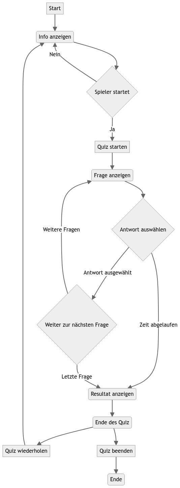
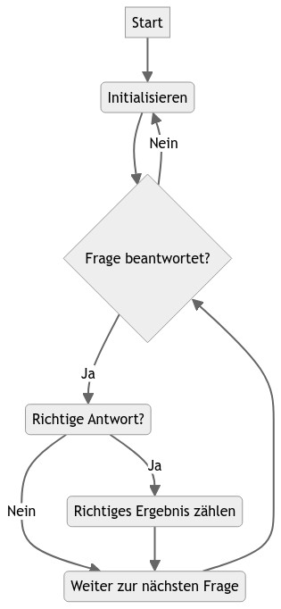
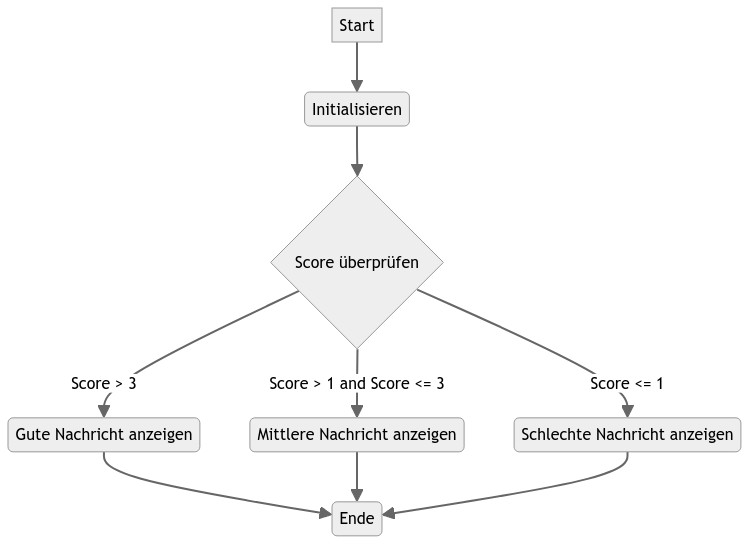

# Quiz: Topographie Sachsens

[](https://img.shields.io/badge/Autor-Maximilian_Kautzsch-blue?link=https%3A%2F%2Fgithub.com%2FMaximilianKautzsch) 

Das vorliegende Projekt ist ein interaktives Geographie-Quiz, das entwickelt wurde, um das Wissen über die Topographie des deutschen Bundeslandes Sachsen zu testen. Die Anwendung ermöglicht es den Benutzern, eine Reihe von Fragen zu beantworten, wobei jede Frage eine begrenzte Zeit hat. Die Benutzer müssen aus einer Auswahl von Antwortmöglichkeiten die richtige Option auswählen. Das Projekt umfasst ein Frontend mit HTML, CSS und JavaScript, das die Benutzeroberfläche für das Quiz bereitstellt, sowie ein Backend, das die Logik für das Zählen der richtigen Antworten und die Auswertung der Ergebnisse enthält.

## Funktionen

| Methode                  | Parameter                        | Beschreibung                                                                                                                                                                                                                    |
| ------------------------ | -------------------------------- | ------------------------------------------------------------------------------------------------------------------------------------------------------------------------------------------------------------------------------- |
| `start_btn.onclick`      | -                                | Event handler für den Klick auf den Start-Quiz-Button. Fügt die Klasse `activeInfo` hinzu, um die Infobox anzuzeigen.                                                                                                           |
| `exit_btn.onclick`       | -                                | Event handler für den Klick auf den Exit-Quiz-Button. Entfernt die Klasse `activeInfo`, um die Infobox zu verbergen.                                                                                                            |
| `continue_btn.onclick`   | -                                | Event handler für den Klick auf den Weiter-Quiz-Button. Entfernt die Klasse `activeInfo`, um die Infobox zu verbergen, und fügt die Klasse `activeQuiz` hinzu, um die Quizbox anzuzeigen. Startet den Timer und die Timerzeile. |
| `restart_quiz.onclick`   | -                                | Event handler für den Klick auf den Quiz neu starten-Button. Setzt die Quizvariablen zurück und startet den Timer und die Timerzeile erneut.                                                                                    |
| `quit_quiz.onclick`      | -                                | Event handler für den Klick auf den Quiz verlassen-Button. Lädt die aktuelle Seite neu.                                                                                                                                         |
| `next_btn.onclick`       | -                                | Event handler für den Klick auf den Weiter-Button. Zeigt die nächste Frage an oder zeigt das Quizergebnis an, wenn alle Fragen beantwortet wurden.                                                                              |
| `showQuetions(index)`    | `index`: Index der Frage         | Funktion zur Anzeige der Frage und der Optionen basierend auf dem übergebenen Index.                                                                                                                                            |
| `optionSelected(answer)` | `answer`: Ausgewählte Antwort    | Funktion zur Behandlung der Auswahl einer Option durch den Benutzer. Überprüft die Antwort auf Richtigkeit und aktualisiert den Punktestand.                                                                                    |
| `showResult()`           | -                                | Funktion zur Anzeige des Quizergebnisses basierend auf dem Benutzerpunktestand.                                                                                                                                                 |
| `startTimer(time)`       | `time`: Anfangswert für die Zeit | Funktion zum Starten des Timers mit dem angegebenen Anfangswert.                                                                                                                                                                |
| `startTimerLine(time)`   | `time`: Anfangswert für die Zeit | Funktion zum Starten der Timerzeile mit dem angegebenen Anfangswert.                                                                                                                                                            |
| `queCounter(index)`      | `index`: Index der Frage         | Funktion zur Aktualisierung des Fragezählers.                                                                                                                                                                                   |

## Flowcharts

Die Flussdiagramme (Flowcharts) visualisieren den Hauptalgorithmus, den Ablauf der Funktionen für das Zählen der richtigen Ergebnisse und die Auswertung der Ergebnisse.

### Hauptalgorithmus



### Zählen der richtigen Antworten



### Auswertung der Ergebnisse



## Source Code [optional, delete if unnecessary]

### Frontend (HTML and JS)

#### `index.html`

```HTML
<!DOCTYPE html>
<html lang="en">
  <head>
    <!-- Meta tags -->
    <meta charset="UTF-8" />
    <meta name="viewport" content="width=device-width, initial-scale=1.0" />
    <!-- Title -->
    <title>Geographie Quiz</title>
    <!-- External CSS -->
    <link rel="stylesheet" href="style.css" />
    <!-- Font Awesome CDN Link for Icons -->
    <link
      rel="stylesheet"
      href="https://cdnjs.cloudflare.com/ajax/libs/font-awesome/5.15.3/css/all.min.css"
    />
  </head>

  <body>
    <!-- Start Quiz Button -->
    <div class="start_btn"><button>Quiz starten</button></div>

    <!-- Info Box -->
    <div class="info_box">
      <!-- Title of the Info Box -->
      <div class="info-title"><span>Spielregeln</span></div>
      <!-- List of Game Rules -->
      <div class="info-list">
        <div class="info">
          1. Dieses Quiz testet dein Wissen zur Topographie Sachsens.
        </div>
        <div class="info">2. Du hast nur 15 Sekunden pro Frage Zeit.</div>
        <div class="info">
          3. Wenn du eine Antwort anklickst, kannst du sie nicht mehr ändern.
        </div>
        <div class="info">
          4. Du kannst das Quiz nicht verlassen, während du spielst.
        </div>
        <div class="info">
          5. Du erhälst Punkte basierend auf deiner Anzahl an richtigen
          Antworten.
        </div>
      </div>
      <!-- Buttons for Quit and Continue -->
      <div class="buttons">
        <button class="quit">Verlassen</button>
        <button class="restart">Fortfahren</button>
      </div>
    </div>

    <!-- Quiz Box -->
    <div class="quiz_box">
      <!-- Header Section -->
      <header>
        <!-- Title of the Quiz -->
        <div class="title">Sachsen Topographie Quiz</div>
        <!-- Timer Section -->
        <div class="timer">
          <div class="time_left_txt">Restzeit</div>
          <div class="timer_sec">15</div>
        </div>
        <!-- Time Line for Question Time -->
        <div class="time_line"></div>
      </header>
      <!-- Question and Options Section -->
      <section>
        <!-- Question Text -->
        <div class="que_text">
          <!-- Here I've inserted question from JavaScript -->
        </div>
        <!-- Option List -->
        <div class="option_list">
          <!-- Here I've inserted options from JavaScript -->
        </div>
      </section>
      <!-- Footer Section -->
      <footer>
        <!-- Total Question Count -->
        <div class="total_que">
          <!-- Here I've inserted Question Count Number from JavaScript -->
        </div>
        <!-- Next Question Button -->
        <button class="next_btn">Nächste Frage</button>
      </footer>
    </div>

    <!-- Result Box -->
    <div class="result_box">
      <!-- Icon -->
      <div class="icon">
        <i class="fas fa-crown"></i>
      </div>
      <!-- Completion Text -->
      <div class="complete_text">Du hast es geschafft!</div>
      <!-- Score Text -->
      <div class="score_text">
        <!-- Here I've inserted Score Result from JavaScript -->
      </div>
      <!-- Buttons for Restart and Quit -->
      <div class="buttons">
        <button class="restart">Wiederholen</button>
        <button class="quit">Quiz beenden</button>
      </div>
    </div>

    <!-- JavaScript files -->
    <!-- Questions Data -->
    <script src="js/questions.js"></script>
    <!-- Quiz Script -->
    <script src="js/script.js"></script>
  </body>
</html>
```

#### `style.css`

```CSS
/**
 * @file styles.css
 * @brief CSS file containing styles for the quiz application.
 */

/* importing google fonts */
@import url("https://fonts.googleapis.com/css2?family=Poppins:wght@200;300;400;500;600;700&display=swap");

/* Resetting default styles */
* {
  margin: 0;
  padding: 0;
  box-sizing: border-box;
  font-family: "Poppins", sans-serif;
}

/* Body styles */
body {
  background: #003975;
}

/* Text selection styles */
::selection {
  color: #fff;
  background: #003975;
}

/* Container styles for various sections */
.start_btn,
.info_box,
.quiz_box,
.result_box {
  position: absolute;
  top: 50%;
  left: 50%;
  transform: translate(-50%, -50%);
  box-shadow: 0 4px 8px 0 rgba(0, 0, 0, 0.2), 0 6px 20px 0 rgba(0, 0, 0, 0.19);
}

/* Active state styles for containers */
.info_box.activeInfo,
.quiz_box.activeQuiz,
.result_box.activeResult {
  opacity: 1;
  z-index: 5;
  pointer-events: auto;
  transform: translate(-50%, -50%) scale(1);
}

/* Button styles */
.start_btn button {
  font-size: 25px;
  font-weight: 500;
  color: #003975;
  padding: 15px 30px;
  outline: none;
  border: none;
  border-radius: 5px;
  background: #fff;
  cursor: pointer;
}

/* Info box styles */
.info_box {
  width: 540px;
  background: #fff;
  border-radius: 5px;
  transform: translate(-50%, -50%) scale(0.9);
  opacity: 0;
  pointer-events: none;
  transition: all 0.3s ease;
}

.info_box .info-title {
  height: 60px;
  width: 100%;
  border-bottom: 1px solid lightgrey;
  display: flex;
  align-items: center;
  padding: 0 30px;
  border-radius: 5px 5px 0 0;
  font-size: 20px;
  font-weight: 600;
}

.info_box .info-list {
  padding: 15px 30px;
}

.info_box .info-list .info {
  margin: 5px 0;
  font-size: 17px;
}

.info_box .info-list .info span {
  font-weight: 600;
  color: #003975;
}

.info_box .buttons {
  height: 60px;
  display: flex;
  align-items: center;
  justify-content: flex-end;
  padding: 0 30px;
  border-top: 1px solid lightgrey;
}

.info_box .buttons button {
  margin: 0 5px;
  height: 40px;
  width: 100px;
  font-size: 16px;
  font-weight: 500;
  cursor: pointer;
  border: none;
  outline: none;
  border-radius: 5px;
  border: 1px solid #003975;
  transition: all 0.3s ease;
}

/* Quiz box styles */
.quiz_box {
  width: 550px;
  background: #fff;
  border-radius: 5px;
  transform: translate(-50%, -50%) scale(0.9);
  opacity: 0;
  pointer-events: none;
  transition: all 0.3s ease;
}

.quiz_box header {
  position: relative;
  z-index: 2;
  height: 70px;
  padding: 0 30px;
  background: #fff;
  border-radius: 5px 5px 0 0;
  display: flex;
  align-items: center;
  justify-content: space-between;
  box-shadow: 0px 3px 5px 1px rgba(0, 0, 0, 0.1);
}

.quiz_box header .title {
  font-size: 20px;
  font-weight: 600;
}

.quiz_box header .timer {
  color: #004085;
  background: #cce5ff;
  border: 1px solid #b8daff;
  height: 45px;
  padding: 0 8px;
  border-radius: 5px;
  display: flex;
  align-items: center;
  justify-content: space-between;
  width: 145px;
}

.quiz_box header .timer .time_left_txt {
  font-weight: 400;
  font-size: 17px;
  user-select: none;
}

.quiz_box header .timer .timer_sec {
  font-size: 18px;
  font-weight: 500;
  height: 30px;
  width: 45px;
  color: #fff;
  border-radius: 5px;
  line-height: 30px;
  text-align: center;
  background: #343a40;
  border: 1px solid #343a40;
  user-select: none;
}

.quiz_box header .time_line {
  position: absolute;
  bottom: 0px;
  left: 0px;
  height: 3px;
  background: #003975;
}

/* Question section styles */
section {
  padding: 25px 30px 20px 30px;
  background: #fff;
}

section .que_text {
  font-size: 25px;
  font-weight: 600;
}

/* Option list styles */
section .option_list {
  padding: 20px 0px;
  display: block;
}

section .option_list .option {
  background: aliceblue;
  border: 1px solid #84c5fe;
  border-radius: 5px;
  padding: 8px 15px;
  font-size: 17px;
  margin-bottom: 15px;
  cursor: pointer;
  transition: all 0.3s ease;
  display: flex;
  align-items: center;
  justify-content: space-between;
}

section .option_list .option:last-child {
  margin-bottom: 0px;
}

section .option_list .option:hover {
  color: #004085;
  background: #cce5ff;
  border: 1px solid #b8daff;
}

section .option_list .option.correct {
  color: #155724;
  background: #d4edda;
  border: 1px solid #c3e6cb;
}

section .option_list .option.incorrect {
  color: #721c24;
  background: #f8d7da;
  border: 1px solid #f5c6cb;
}

section .option_list .option.disabled {
  pointer-events: none;
}

section .option_list .option .icon {
  height: 26px;
  width: 26px;
  border: 2px solid transparent;
  border-radius: 50%;
  text-align: center;
  font-size: 13px;
  pointer-events: none;
  transition: all 0.3s ease;
  line-height: 24px;
}

.option_list .option .icon.tick {
  color: #23903c;
  border-color: #23903c;
  background: #d4edda;
}

.option_list .option .icon.cross {
  color: #a42834;
  background: #f8d7da;
  border-color: #a42834;
}

/* Footer styles */
footer {
  height: 60px;
  padding: 0 30px;
  display: flex;
  align-items: center;
  justify-content: space-between;
  border-top: 1px solid lightgrey;
}

footer .total_que span {
  display: flex;
  user-select: none;
}

footer .total_que span p {
  font-weight: 500;
  padding: 0 5px;
}

footer .total_que span p:first-child {
  padding-left: 0px;
}

footer button {
  height: 40px;
  padding: 0 13px;
  font-size: 18px;
  font-weight: 400;
  cursor: pointer;
  border: none;
  outline: none;
  color: #fff;
  border-radius: 5px;
  background: #003975;
  border: 1px solid #003975;
  line-height: 10px;
  opacity: 0;
  pointer-events: none;
  transform: scale(0.95);
  transition: all 0.3s ease;
}

footer button:hover {
  background: #003975be;
}

footer button.show {
  opacity: 1;
  pointer-events: auto;
  transform: scale(1);
}

/* Result box styles */
.result_box {
  background: #fff;
  border-radius: 5px;
  display: flex;
  padding: 25px 30px;
  width: 450px;
  align-items: center;
  flex-direction: column;
  justify-content: center;
  transform: translate(-50%, -50%) scale(0.9);
  opacity: 0;
  pointer-events: none;
  transition: all 0.3s ease;
}

.result_box .icon {
  font-size: 100px;
  color: #003975;
  margin-bottom: 10px;
}

.result_box .complete_text {
  font-size: 20px;
  font-weight: 500;
}

.result_box .score_text span {
  display: flex;
  margin: 10px 0;
  font-size: 18px;
  font-weight: 500;
}

.result_box .score_text span p {
  padding: 0 4px;
  font-weight: 600;
}

.result_box .buttons {
  display: flex;
  margin: 20px 0;
}

.result_box .buttons button {
  margin: 0 10px;
  height: 45px;
  padding: 0 20px;
  font-size: 18px;
  font-weight: 500;
  cursor: pointer;
  border: none;
  outline: none;
  border-radius: 5px;
  border: 1px solid #003975;
  transition: all 0.3s ease;
}

.buttons button.restart {
  color: #fff;
  background: #003975;
}

.buttons button.restart:hover {
  background: #003975be;
}

.buttons button.quit {
  color: #003975;
  background: #fff;
}

.buttons button.quit:hover {
  color: #fff;
  background: #003975;
}

/* Question image styles */
.que_text img {
  display: block;
  margin-left: auto;
  margin-right: auto;
  width: 400px;
  margin-bottom: 10px;
  border-radius: 10px;
  box-shadow: 2px 2px 6px rgba(0, 0, 0, 0.4);
  object-fit: cover;
}
```

### Backend

#### `questions.js`

```JS
/**
 * @file questions.js
 * @brief JavaScript file containing an array of quiz questions.
 */

// Array containing quiz questions, options, and correct answers
let questions = [
  {
    numb: 1,
    question: "Welches Gebirge ist gesucht?",
    answer: "Elbsandsteingebirge",
    options: [
      "Elbsandsteingebirge",
      "Erzgebirge",
      "Zittauer Gebirge",
      "Elstergebirge",
    ],
  },
  {
    numb: 2,
    question: "Welche Stadt ist gesucht?",
    answer: "Dresden",
    options: ["Freiberg", "Pirna", "Dresden", "Freital"],
  },
  {
    numb: 3,
    question: "Weche Stadt ist gesucht?",
    answer: "Leipzig",
    options: ["Zwickau", "Torgau", "Leipzig", "Delitzsch"],
  },
  {
    numb: 4,
    question: "Welcher Fluss ist gesucht?",
    answer: "Zschopau",
    options: ["Freiberger Mulde", "Zwickauer Mulde", "Flöha", "Zschopau"],
  },
  {
    numb: 5,
    question: "Welche Stadt ist gesucht?",
    answer: "Glauchau",
    options: ["Zwickau", "Glauchau", "Limbach-Oberfrohna", "Werdau"],
  },
];
```

#### `script.js`

```JS
/**
 * @file script.js
 * @brief JavaScript file containing functions for managing the quiz application.
 */

// Selecting all required elements
const start_btn =
  document.querySelector(".start_btn button"); /**< Start button element */
const info_box = document.querySelector(".info_box"); /**< Info box element */
const exit_btn =
  info_box.querySelector(".buttons .quit"); /**< Exit button element */
const continue_btn =
  info_box.querySelector(".buttons .restart"); /**< Continue button element */
const quiz_box = document.querySelector(".quiz_box"); /**< Quiz box element */
const result_box =
  document.querySelector(".result_box"); /**< Result box element */
const option_list =
  document.querySelector(".option_list"); /**< Option list element */
const time_line =
  document.querySelector("header .time_line"); /**< Time line element */
const timeText = document.querySelector(
  ".timer .time_left_txt"
); /**< Time left text element */
const timeCount =
  document.querySelector(".timer .timer_sec"); /**< Timer count element */
const restart_quiz =
  result_box.querySelector(
    ".buttons .restart"
  ); /**< Restart quiz button element */
const quit_quiz =
  result_box.querySelector(".buttons .quit"); /**< Quit quiz button element */
const next_btn =
  document.querySelector(
    "footer .next_btn"
  ); /**< Next question button element */
const bottom_ques_counter =
  document.querySelector(
    "footer .total_que"
  ); /**< Total question counter element */

/**
 * @brief Event handler for the start quiz button click.
 */
start_btn.onclick = () => {
  info_box.classList.add(
    "activeInfo"
  ); /**< Add activeInfo class to show info box */
};

/**
 * @brief Event handler for the exit quiz button click.
 */
exit_btn.onclick = () => {
  info_box.classList.remove(
    "activeInfo"
  ); /**< Remove activeInfo class to hide info box */
};

/**
 * @brief Event handler for the continue quiz button click.
 */
continue_btn.onclick = () => {
  info_box.classList.remove(
    "activeInfo"
  ); /**< Remove activeInfo class to hide info box */
  quiz_box.classList.add(
    "activeQuiz"
  ); /**< Add activeQuiz class to show quiz box */
  showQuetions(0); /**< Show the first question */
  queCounter(1); /**< Update the question counter */
  startTimer(15); /**< Start the timer */
  startTimerLine(0); /**< Start the timer line */
};

// Initialize variables
let timeValue = 15; /**< Initial time value */
let que_count = 0; /**< Question count */
let que_numb = 1; /**< Question number */
let userScore = 0; /**< User score */
let counter; /**< Timer counter */
let counterLine; /**< Timer line counter */
let widthValue = 0; /**< Timer line width */

/**
 * @brief Event handler for the restart quiz button click.
 */
restart_quiz.onclick = () => {
  quiz_box.classList.add(
    "activeQuiz"
  ); /**< Add activeQuiz class to show quiz box */
  result_box.classList.remove(
    "activeResult"
  ); /**< Remove activeResult class to hide result box */
  // Reset variables
  timeValue = 15;
  que_count = 0;
  que_numb = 1;
  userScore = 0;
  widthValue = 0;
  showQuetions(que_count); /**< Show the first question */
  queCounter(que_numb); /**< Update the question counter */
  clearInterval(counter); /**< Clear timer counter */
  clearInterval(counterLine); /**< Clear timer line counter */
  startTimer(timeValue); /**< Start the timer */
  startTimerLine(widthValue); /**< Start the timer line */
  timeText.textContent = "Restzeit"; /**< Update timer text */
  next_btn.classList.remove("show"); /**< Hide next button */
};

/**
 * @brief Event handler for the quit quiz button click.
 */
quit_quiz.onclick = () => {
  window.location.reload(); /**< Reload the current window */
};

/**
 * @brief Event handler for the next question button click.
 */
next_btn.onclick = () => {
  if (que_count < questions.length - 1) {
    que_count++; /**< Increment question count */
    que_numb++; /**< Increment question number */
    showQuetions(que_count); /**< Show the next question */
    queCounter(que_numb); /**< Update the question counter */
    clearInterval(counter); /**< Clear timer counter */
    clearInterval(counterLine); /**< Clear timer line counter */
    startTimer(timeValue); /**< Start the timer */
    startTimerLine(widthValue); /**< Start the timer line */
    timeText.textContent = "Restzeit"; /**< Update timer text */
    next_btn.classList.remove("show"); /**< Hide next button */
  } else {
    clearInterval(counter); /**< Clear timer counter */
    clearInterval(counterLine); /**< Clear timer line counter */
    showResult(); /**< Show the quiz result */
  }
};

/**
 * @brief Function to display the question and options.
 * @param index - Index of the question.
 */
function showQuetions(index) {
  const que_text =
    document.querySelector(".que_text"); /**< Question text element */
  // Create HTML for question and options
  let que_tag =
    "<span class='que-img-container'>" +
    "" +
    "</span>" +
    "<span>" +
    questions[index].numb +
    ". " +
    questions[index].question +
    "</span>";
  let option_tag =
    '<div class="option"><span>' +
    questions[index].options[0] +
    "</span></div>" +
    '<div class="option"><span>' +
    questions[index].options[1] +
    "</span></div>" +
    '<div class="option"><span>' +
    questions[index].options[2] +
    "</span></div>" +
    '<div class="option"><span>' +
    questions[index].options[3] +
    "</span></div>";
  que_text.innerHTML = que_tag; /**< Update question text */
  option_list.innerHTML = option_tag; /**< Update option list */

  const option = option_list.querySelectorAll(".option"); /**< Option list */
  // Add onclick attribute to all options
  for (i = 0; i < option.length; i++) {
    option[i].setAttribute("onclick", "optionSelected(this)");
  }
}

/**
 * @brief Function to handle option selection.
 * @param answer - Selected answer.
 */
function optionSelected(answer) {
  clearInterval(counter); /**< Clear timer counter */
  clearInterval(counterLine); /**< Clear timer line counter */
  let userAns = answer.textContent; /**< User selected answer */
  let correcAns = questions[que_count].answer; /**< Correct answer */
  const allOptions =
    option_list.children.length; /**< Total number of options */

  // Check if the user's answer is correct
  if (userAns == correcAns) {
    userScore += 1; /**< Increment user score */
    answer.classList.add(
      "correct"
    ); /**< Add correct class to selected option */
    answer.insertAdjacentHTML("beforeend", tickIconTag); /**< Add tick icon */
    console.log("Correct Answer");
    console.log("Your correct answers = " + userScore);
  } else {
    answer.classList.add(
      "incorrect"
    ); /**< Add incorrect class to selected option */
    answer.insertAdjacentHTML("beforeend", crossIconTag); /**< Add cross icon */
    console.log("Wrong Answer");
    // Auto-select correct answer
    for (i = 0; i < allOptions; i++) {
      if (option_list.children[i].textContent == correcAns) {
        option_list.children[i].setAttribute(
          "class",
          "option correct"
        ); /**< Add correct class to correct option */
        option_list.children[i].insertAdjacentHTML(
          "beforeend",
          tickIconTag
        ); /**< Add tick icon */
        console.log("Auto selected correct answer.");
      }
    }
  }
  // Disable all options
  for (i = 0; i < allOptions; i++) {
    option_list.children[i].classList.add("disabled");
  }
  next_btn.classList.add("show"); /**< Show next button */
}

/**
 * @brief Function to display the quiz result.
 */
function showResult() {
  info_box.classList.remove(
    "activeInfo"
  ); /**< Remove activeInfo class to hide info box */
  quiz_box.classList.remove(
    "activeQuiz"
  ); /**< Remove activeQuiz class to hide quiz box */
  result_box.classList.add(
    "activeResult"
  ); /**< Add activeResult class to show result box */
  const scoreText =
    result_box.querySelector(".score_text"); /**< Score text element */
  // Display different messages based on the score
  if (userScore > 3) {
    let scoreTag =
      "<span>Super! Du hast <p>" +
      userScore +
      "</p> von <p>" +
      questions.length +
      "</p> Fragen richtig.</span>";
    scoreText.innerHTML = scoreTag;
  } else if (userScore > 1) {
    let scoreTag =
      "<span>Gut! Du hast <p>" +
      userScore +
      "</p> von <p>" +
      questions.length +
      "</p> Fragen richtig.</span>";
    scoreText.innerHTML = scoreTag;
  } else {
    let scoreTag =
      "<span>Schade! Du hast <p>" +
      userScore +
      "</p> von <p>" +
      questions.length +
      "</p> Fragen richtig.</span>";
    scoreText.innerHTML = scoreTag;
  }
}

/**
 * @brief Function to start the timer.
 * @param time - Initial time value.
 */
function startTimer(time) {
  counter = setInterval(timer, 1000);
  function timer() {
    timeCount.textContent = time; /**< Update timer count */
    time--; /**< Decrement time */
    if (time < 9) {
      let addZero = timeCount.textContent;
      timeCount.textContent = "0" + addZero; /**< Add leading zero */
    }
    if (time < 0) {
      clearInterval(counter); /**< Clear timer counter */
      timeText.textContent = "Time Off"; /**< Update timer text */
      const allOptions =
        option_list.children.length; /**< Total number of options */
      let correcAns = questions[que_count].answer; /**< Correct answer */
      // Auto-select correct answer
      for (i = 0; i < allOptions; i++) {
        if (option_list.children[i].textContent == correcAns) {
          option_list.children[i].setAttribute(
            "class",
            "option correct"
          ); /**< Add correct class to correct option */
          option_list.children[i].insertAdjacentHTML(
            "beforeend",
            tickIconTag
          ); /**< Add tick icon */
          console.log("Time Off: Auto selected correct answer.");
        }
      }
      // Disable all options
      for (i = 0; i < allOptions; i++) {
        option_list.children[i].classList.add("disabled");
      }
      next_btn.classList.add("show"); /**< Show next button */
    }
  }
}

/**
 * @brief Function to start the timer line.
 * @param time - Initial time value.
 */
function startTimerLine(time) {
  counterLine = setInterval(timer, 29);
  function timer() {
    time += 1; /**< Increment time */
    time_line.style.width = time + "px"; /**< Update timer line width */
    if (time > 549) {
      clearInterval(counterLine); /**< Clear timer line counter */
    }
  }
}

/**
 * @brief Function to update the question counter.
 * @param index - Index of the question.
 */
function queCounter(index) {
  let totalQueCounTag =
    "<span><p>" +
    index +
    "</p> von <p>" +
    questions.length +
    "</p> Fragen</span>";
  bottom_ques_counter.innerHTML =
    totalQueCounTag; /**< Update question counter */
}
```

- @param index - Index of the question.
  _/
  function queCounter(index) {
  let totalQueCounTag =
  "<span><p>" +
  index +
  "</p> von <p>" +
  questions.length +
  "</p> Fragen</span>";
  bottom_ques_counter.innerHTML =
  totalQueCounTag; /\*\*< Update question counter _/
  }

```

```
