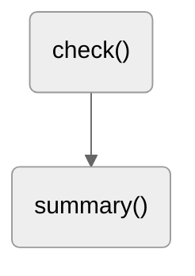

# Quiz: Topographie Sachsens

Das Thema dieser Projektarbeit in Informatik (Klassenstufe 10) ist ein Quiz zur Topographie Sachsens, welches in HTML und CSS (Frontend) sowie Javascript (Backend) entwickelt wurde.

| Name     | Vorname    | Klasse |
| -------- | ---------- | ------ |
| Kautzsch | Maximilian | 10/3   |

## Funktionen

| Methode   | Parameter                   | Beschreibung                                                                                                                               |
| --------- | --------------------------- | ------------------------------------------------------------------------------------------------------------------------------------------ |
| `showQuetions()` | `index` | Greift auf die Frage aus dem Array `questions[]` zu und aktualisiert die dazugehörigen HTML-Elemente. |
| `optionSelected()` | `answer` | Führt spezifische Commands aus, wenn der User eine Antwort auswählt. |
| `showResult()` | - | Zeigt das Endresultat an, wenn das Quiz vollendet wurde. Spezifische 
motivierende Aussage je nach Resultat des Users. |
| `startTimer()` | `time` | Lässt den Countdown laufen (Dauer: 15sec), bis der User eine Antwort ausgewählt hat. |
| `startTimerLine()` | `time` | Aktualisiert die Progress-Bar des Countdowns. |
| `queCounter()` | `index` | Aktualisiert die Anzeige des aktuellen Frageindexes. |

## Algorithmen

