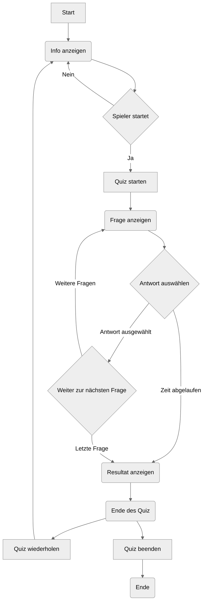
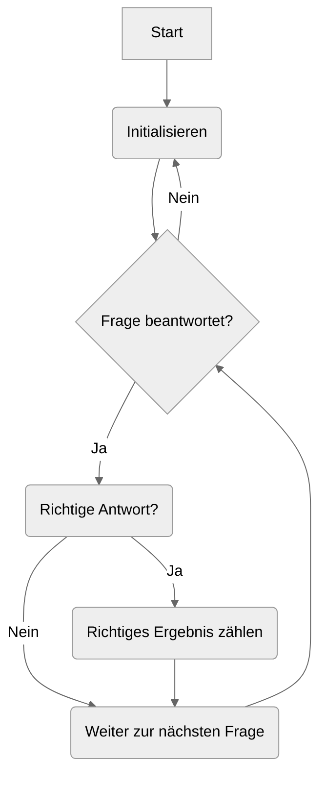
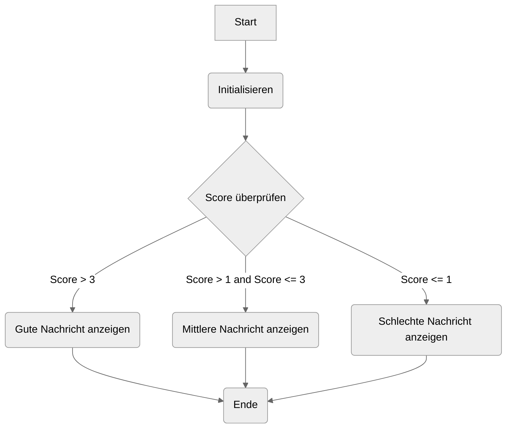

# Quiz: Topographie Sachsens

Das vorliegende Projekt ist ein interaktives Geographie-Quiz, das entwickelt wurde, um das Wissen über die Topographie des deutschen Bundeslandes Sachsen zu testen. Die Anwendung ermöglicht es den Benutzern, eine Reihe von Fragen zu beantworten, wobei jede Frage eine begrenzte Zeit hat. Die Benutzer müssen aus einer Auswahl von Antwortmöglichkeiten die richtige Option auswählen. Das Projekt umfasst ein Frontend mit HTML, CSS und JavaScript, das die Benutzeroberfläche für das Quiz bereitstellt, sowie ein Backend, das die Logik für das Zählen der richtigen Antworten und die Auswertung der Ergebnisse enthält.

<table>
  <thead>
    <tr>
      <th>Name</th>
      <th>Vorname</th>
      <th>Klasse</th>
    </tr>
  </thead>
  <tbody>
    <tr>
      <td>Kautzsch</td>
      <td>Maximilian</td>
      <td>10/3</td>
    </tr>
  </tbody>
</table>

## Funktionen

| Methode                  | Parameter                        | Beschreibung                                                                                                                                                                                                                    |
| ------------------------ | -------------------------------- | ------------------------------------------------------------------------------------------------------------------------------------------------------------------------------------------------------------------------------- |
| `start_btn.onclick`      | -                                | Event handler für den Klick auf den Start-Quiz-Button. Fügt die Klasse `activeInfo` hinzu, um die Infobox anzuzeigen.                                                                                                           |
| `exit_btn.onclick`       | -                                | Event handler für den Klick auf den Exit-Quiz-Button. Entfernt die Klasse `activeInfo`, um die Infobox zu verbergen.                                                                                                            |
| `continue_btn.onclick`   | -                                | Event handler für den Klick auf den Weiter-Quiz-Button. Entfernt die Klasse `activeInfo`, um die Infobox zu verbergen, und fügt die Klasse `activeQuiz` hinzu, um die Quizbox anzuzeigen. Startet den Timer und die Timerzeile. |
| `restart_quiz.onclick`   | -                                | Event handler für den Klick auf den Quiz neu starten-Button. Setzt die Quizvariablen zurück und startet den Timer und die Timerzeile erneut.                                                                                    |
| `quit_quiz.onclick`      | -                                | Event handler für den Klick auf den Quiz verlassen-Button. Lädt die aktuelle Seite neu.                                                                                                                                         |
| `next_btn.onclick`       | -                                | Event handler für den Klick auf den Weiter-Button. Zeigt die nächste Frage an oder zeigt das Quizergebnis an, wenn alle Fragen beantwortet wurden.                                                                              |
| `showQuetions(index)`    | `index`: Index der Frage         | Funktion zur Anzeige der Frage und der Optionen basierend auf dem übergebenen Index.                                                                                                                                            |
| `optionSelected(answer)` | `answer`: Ausgewählte Antwort    | Funktion zur Behandlung der Auswahl einer Option durch den Benutzer. Überprüft die Antwort auf Richtigkeit und aktualisiert den Punktestand.                                                                                    |
| `showResult()`           | -                                | Funktion zur Anzeige des Quizergebnisses basierend auf dem Benutzerpunktestand.                                                                                                                                                 |
| `startTimer(time)`       | `time`: Anfangswert für die Zeit | Funktion zum Starten des Timers mit dem angegebenen Anfangswert.                                                                                                                                                                |
| `startTimerLine(time)`   | `time`: Anfangswert für die Zeit | Funktion zum Starten der Timerzeile mit dem angegebenen Anfangswert.                                                                                                                                                            |
| `queCounter(index)`      | `index`: Index der Frage         | Funktion zur Aktualisierung des Fragezählers.                                                                                                                                                                                   |

## Flowcharts

Die Flussdiagramme (Flowcharts) visualisieren den Hauptalgorithmus, den Ablauf der Funktionen für das Zählen der richtigen Ergebnisse und die Auswertung der Ergebnisse.

### Hauptalgorithmus

### Zählen der richtigen Antworten

### Auswertung der Ergebnisse

