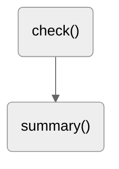

# Quiz: Topographie Sachsens

Das Thema dieser Projektarbeit in Informatik (Klassenstufe 10) ist ein Quiz zur Topographie Sachsens, welches in HTML und CSS (Frontend) sowie Javascript (Backend) entwickelt wurde.

| Name     | Vorname    | Klasse |
| -------- | ---------- | ------ |
| Kautzsch | Maximilian | 10/3   |

## Funktionen

| Methode   | Parameter                   | Beschreibung                                                                                                                               |
| --------- | --------------------------- | ------------------------------------------------------------------------------------------------------------------------------------------ |
| `check()` | `question`, `correct_index` | Prüft durch einen Vergleich des gecheckten Radiobuttons mit `correct_index`, ob die entsprechende Frage der Nummer `question` richtig ist. |

## Algorithmen

